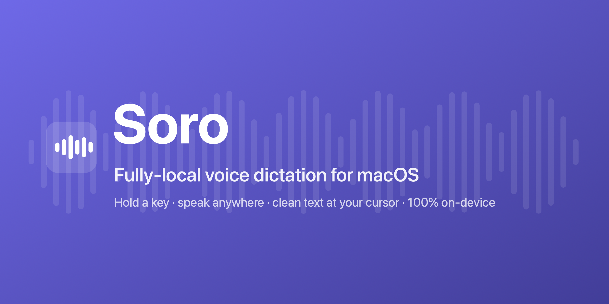
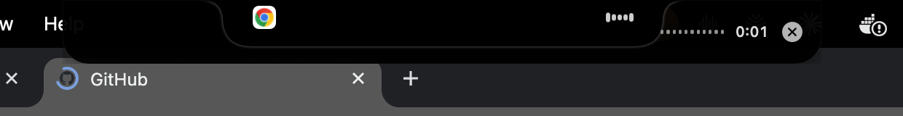
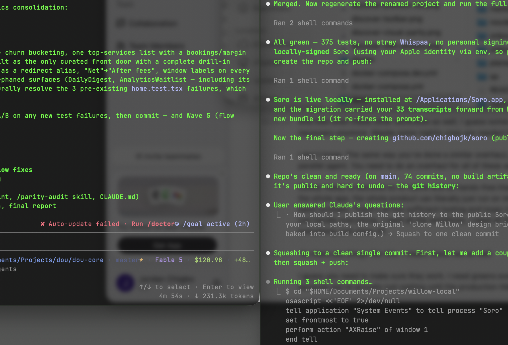
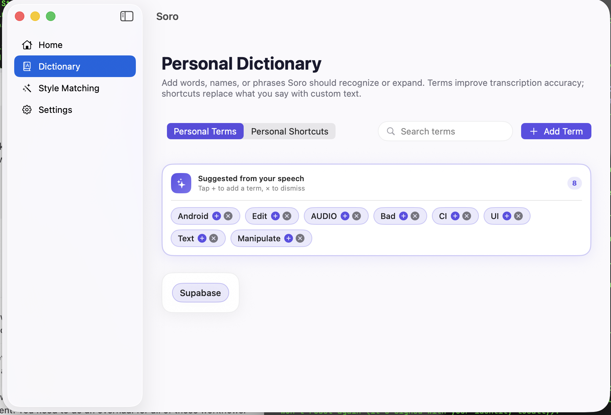
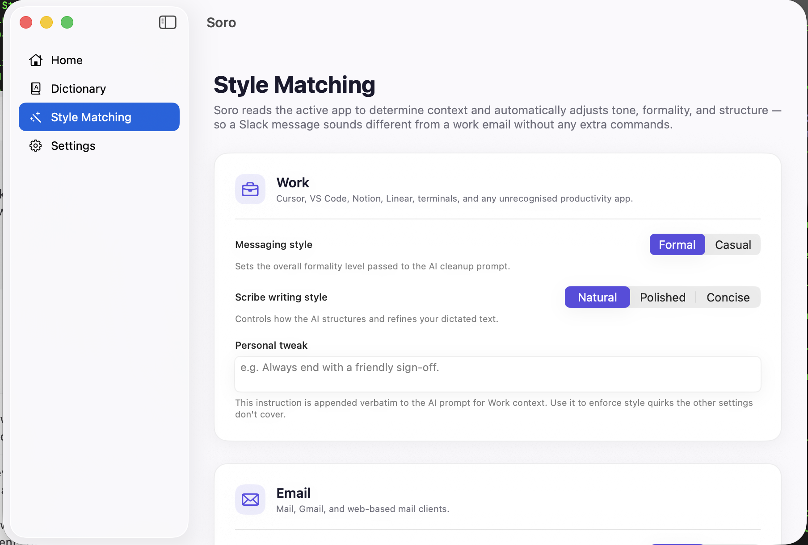
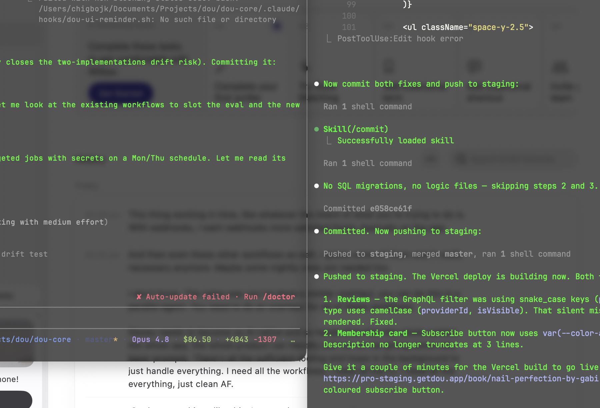

<p align="center">
  
</p>

<p align="center">
  <a href="https://github.com/chigbojk/soro/actions/workflows/ci.yml"></a>
  <a href="https://github.com/chigbojk/soro/releases/latest"></a>
  <a href="LICENSE"></a>
  
  
</p>

# Soro

**Soro — a fully-local, on-device voice dictation app for macOS. Hold a key, speak anywhere, get clean text.**

### ⬇️ [Download the latest `.dmg`](https://github.com/chigbojk/soro/releases/latest) &nbsp;·&nbsp; or [build from source](#build--run)

Soro (Yoruba: *ṣọ̀rọ̀*, "to speak / to shout") lets you hold a key, speak into any app,
and get clean, well-formatted text inserted at your cursor. Everything runs on your Mac —
transcription and cleanup are 100% on-device. No accounts, no telemetry, no internet
connection required.

## Screenshots

**Dynamic Island recording bar** — hugs the notch while you dictate (frontmost-app icon · live waveform · timer):



| Home | Personal Dictionary |
| --- | --- |
|  |  |

| Style Matching | Settings |
| --- | --- |
|  |  |

## Features

- **Push-to-talk + double-tap lock** — hold Left Option to dictate and release to insert;
  double-tap to lock hands-free, tap once to stop.
- **Dynamic Island notch bar** — a floating indicator near the notch with a live waveform
  and the active app's icon; draggable and position-remembering.
- **100% on-device transcription** — Whisper via WhisperKit (Core ML / Metal); nothing is
  uploaded.
- **Local LLM cleanup via Ollama** — optional grammar/punctuation/formatting polish with a
  faithfulness guard so it never invents content. Raw-transcript mode works with no LLM.
- **Personal dictionary + auto-learn** — inject custom terms and shortcuts; Soro surfaces
  proper nouns and jargon it sees repeatedly so you can add them in one tap.
- **Per-context style matching** — reads the active app and adapts tone, formality, and
  structure (a Slack message reads differently from a work email).
- **Snippets / shortcuts** — expand short phrases into custom text.
- **VAD sensitivity** — tune voice-activity detection to your mic and environment.
- **Streaming transcription** — long recordings are transcribed in chunks so stopping is fast.
- **Model pickers** — choose and download Whisper and Ollama models from Settings.
- **Stats + monthly recap** — words dictated, time saved, day streak, top words and apps, a
  "Wrapped"-style monthly recap.
- **Status toasts** — transcribing / failed indicators with a countdown bar.

## 100% local & private

- Audio is captured and transcribed entirely on-device with WhisperKit (Core ML / Metal).
- Optional cleanup runs against a **local** Ollama server on `127.0.0.1:11434`.
- No accounts, no analytics, no telemetry. The only network connection Soro ever makes is to
  your local Ollama instance, and only when cleanup is enabled.
- History, dictionary, and preferences live in plain JSON under
  `~/Library/Application Support/com.jordanchigbo.soro/`.
- Privacy mode (Settings) deletes each audio file immediately after transcription.

## Requirements

- macOS 14 (Sonoma) or later, **Apple Silicon**
- Xcode 15+ (to build from source)
- [XcodeGen](https://github.com/yonaskolb/XcodeGen): `brew install xcodegen`
- [Ollama](https://ollama.com) (optional, for cleanup): `brew install ollama` + a model

## Build & run

The Xcode project is generated from `project.yml` and is **not** committed — regenerate it
after cloning:

```bash
git clone https://github.com/chigbojk/soro.git
cd soro
xcodegen generate

# build from the command line...
xcodebuild -project Soro.xcodeproj -scheme Soro -destination 'platform=macOS' build

# ...or open Soro.xcodeproj in Xcode and run the Soro scheme.
```

By default Soro builds with **ad-hoc** signing (`CODE_SIGN_IDENTITY="-"`), so a plain clone
builds with zero setup — no Apple Developer account or certificate required.

On first launch:

1. Grant **Microphone** access when prompted.
2. Grant **Accessibility** in **System Settings → Privacy & Security → Accessibility**
   (required for the global hotkey and text insertion).
3. Download a **Whisper** model in Settings (Base.en is a good start).
4. Optionally enable cleanup: `ollama pull llama3.2:3b` and make sure `ollama serve` is running.

Then hold **Left Option** anywhere and start speaking.

### Optional: signed local builds

Ad-hoc signatures change on every rebuild, which makes macOS re-prompt for Microphone and
Accessibility each time. If you have an Apple Development identity, export it before building
or packaging so the signature (and your TCC grants) stay stable:

```bash
export SORO_SIGN_ID="Apple Development: Your Name (XXXXXXXXXX)"
export SORO_TEAM_ID="YOURTEAMID"
./scripts/package.sh
```

`scripts/package.sh` builds a Release `.app` and wraps it in `dist/Soro.dmg` with an
`INSTALL.txt`. Without those env vars it builds ad-hoc.

## Run tests

```bash
xcodebuild -project Soro.xcodeproj -scheme Soro -destination 'platform=macOS' test
```

## Architecture overview

Soro is a menu-bar (accessory) app with no Dock icon.

```
SoroApp (SwiftUI App)
├── AppState              — composition root; wires all services; runs first-launch data migration
├── DictationCoordinator  — state machine: idle → recording → transcribing → inserting → done
├── HotkeyManager         — CGEventTap, push-to-talk + double-tap lock detection
├── AudioCaptureService   — AVAudioEngine, 16 kHz mono PCM
├── TranscriptionService  — WhisperKit (Core ML / Metal), streaming/chunked
├── CleanupService        — Ollama HTTP API (127.0.0.1:11434), style + glossary passes
├── InsertionService      — NSPasteboard paste + typed CGEvent fallback
├── Stores                — plain JSON on disk (transcripts, preferences, glossary, stats)
└── UI
    ├── MenuBarExtra       — state icon + menu
    ├── RecordingBarPanel  — floating Dynamic Island notch bar (AppKit NSPanel)
    ├── DashboardWindow    — SwiftUI dashboard: Home, Dictionary, Style, Settings
    └── OnboardingView     — first-run wizard
```

## Not affiliated

Soro is an independent, from-scratch reimplementation, inspired by the general experience of
apps like **Willow Voice** and **Wispr Flow**. It is **not affiliated with, endorsed by, or
derived from** either. No code, assets, models, or resources from those apps are used. All
product names are trademarks of their respective owners.

## Contributing

Contributions are welcome — see [CONTRIBUTING.md](CONTRIBUTING.md).

## License

MIT — see [LICENSE](LICENSE). Third-party components are listed in
[THIRD-PARTY-LICENSES.md](THIRD-PARTY-LICENSES.md).
